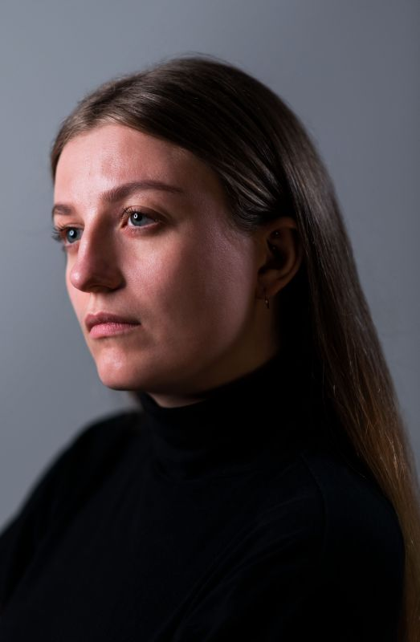

### Introduction

Welcome to the eye-friendly programme page for the performance of Bloom, by NKK NXT 20/21 (Immix). Please do not forget to turn your phone to silent and/or airplane mode when the concert starts.

### Programme

#### Ragnheiður Erla Björnsdóttir ⁠— _Bloom_

#### Ragnheiður Erla Björnsdóttir ⁠— _Okeme Babel_

#### Se Enkhbayar ⁠— _The Praise of Eight Steeds_

Lyrics (click)

**(Name of poet)**

The huangbiao horse carries the sun on its mane
The yellow horse sweeps down the moon by its tail
The yellow horse’s body is connected to the grassland
The yellow horse’s back reflects the light of the coloured clouds
The neighing of the horse shakes the world
The yellow horse kicks and breaks the mountain
The yellow horse is calling for Mongolian warriors
The yellow horse is full of strength Genghis Khan’s loyal companion
Mother Nature’s selfless blessing I am a flower on the wallpaper's face,And repeat from here to there;While standing midst the birch leaves' greenOn all the walls, a bloom so fair.And yet you do not see me well enough,While sitting with me above,But gaze as if I were but some puzzle's fluff -Have you gone mad, my love?The pride of the Mongolians The majesty of the war horses 
Thousands of songs circulate on the grasslands and leave good reputation The fire of passion; the source of wisdom The totem of worship; the conviction of victory The flag in the heart; the arrow of the strong The idea horse; the sublimation of thoughts The spirit of fighting; the revitalised sunrise We praise you, the eight yellow horses, the ideal horses

#### Ragnheiður Erla Björnsdóttir ⁠— _re:shape_
#### Einojuhani Rautavaara ⁠— _Malagueña_

Lyrics

**Federico García Lorca**

La muerte 
	<i>Death</i>
entra y sale 
	<i>enters and leaves</i>
de la taberna. 
	<i>the tavern.</i> 
Pasan caballos negros 
	<i>Black stallions</i>
y gente siniestra 
	<i>and sinister people</i>
por los hondos caminos 
	<i>pass down the deep roads</i>
de la guitarra. 
	<i>of the guitar.</i> 
Y hay un olor a sal
    <i>And there is a smell of salt</i>
y a sangre de hembra, 
	<i>and of female blood,</i>
en los nardos febriles
	<i>in the feverish tuberoses</i>
de la marina. 
	<i>of the seaside.</i> 
La muerte 
	<i>Death</i>
entra y sale, 
	<i>enters and leaves</i>
y sale y entra 
	<i>and leaves and enters</i>
la muerte 
    <i>the death</i>
de la taberna.
    <i>of the tavern.</i>

#### Ragnheiður Erla Björnsdóttir ⁠— _curls I_

#### Erik Bergman ⁠— _Vier Galgenlieder_

2. <i>Tapetenblume</i>

**Christian Morgenstern**

Tapetenblume bin ich fein,
    <i>Wallpaper flowers am I prettily,</i>
kehr wieder ohne Ende,
    <i>return without end,</i>
doch, statt im Mai'n und Mondenschein,
    <i>but, instead of in May and moonlight,</i>
auf jeder der vier Wände.
    <i>on all four of the walls.</i> 
Du siehst mich nimmerdar genung,
    <i>You never see me enough,</i>
so weit du blickst im Stübchen,
    <i>as far as you look in the sitting room,</i>
und folgst du mir per Rösselsprung –
    <i>and if you follow me by a knight's move (chess) –</i>
wirst du verrückt, mein Liebchen. 
    <i>you'll go mad, my love.</i>

#### Ragnheiður Erla Björnsdóttir ⁠— _curls II_

#### Erik Bergman ⁠— _Vier Galgenlieder_

1. <i>Das grosse Lalula</i>

**Christian Morgenstern**

Kroklokwafzi? Sem̄emem̄i!
Seiokrontro – prafriplo:
Bifzi, bafzi; hulalem̄i:
quasti basti bo…
Lalu lalu lalu lalu la! 
Hontraruru miromente
zasku zes rü rü?
Entepente, leiolente
klekwapufzi lü?
Lalu lalu lalu lala la! 
Simarat kos malzlpempu
silzuzankunkrei (;)!
Marjomar dos: Quempu Lempu
Siri Suri Sei [ ]!
Lalu lalu lalu lalu la!

#### Ragnheiður Erla Björnsdóttir ⁠— _curls III_

#### Ruben Grevelink, Jobbe Hoebink & Jesse van der Wel ⁠— _When we don't see_

Lyrics

**Jobbe Hoebink**

Lies and truth denied, 
to prove our pride, 
guide our game 
Lies and truth denied, 
to smooth the sides,  
hide our shame 
In fear, who’ll understand? 
One wonders; ‘who is foe? who is friend?’          
that record plays all over again 
Woman nor man can mend… 
Lies and truth denied, 
to separate and divide   
One look, but none who see
Staring blind in bright L.E.D. 
There’s no connection		
How could there be?
Just let it be!			Please, be! 
When we don’t see,   		
It seems that we         	
in our anguish              	
are blinding the eye   	
to what could be.        	
Opening eyes, 
So much we can realise
When we see!	 
Much as fright begs 
the body to fight or flee				
From heart to heart to heart to heart, flow!	 
From heart to heart to heart to heart, know! 
There lies truth
In the branch of an olive tree
From heart to heart to heart to heart, see!
From heart to heart to heart to heart, be!
Steadily, show me… 
When we don’t see,   
It seems that we     
in our anguish              
are blinding the eye   
to what could be.   
Mirrors in us call
Can we look at our reflection?
We all must take action
You see
To avoid the debris 
Open eyes.
Realise and see. 
On Common ground
Once found
There’s a space 
Where all of us can be
Where you and me are we

#### James MacMillan ⁠— _O Radiant Dawn_

Lyrics

O Radiant Dawn,
Splendour of eternal Light,
Sun of Justice: come,
Shine on those who dwell in darkness
And the shadow of death.
Isaiah had prophesied, 
'The people who walked in darkness
have seen a  great light:
Upon those who dwelt in the land of gloom
a light has shone.'
Amen.     

#### William Byrd — _Ave Verum Corpus_

Lyrics

Ave verum Corpus, natum
    <i>Hail true body, born</i>
De Maria Virgine,
    <i>of virgin Mary,</i>
Vere passum, immolatum
    <i>having truly suffered, sacrificed</i>
In cruce pro homine,
    <i>on the cross for mankind,</i>
Cuius latus perforatum
    <i>from whose injured side</i>
Unda fluxit sanguine:
    <i>whence flows blood:</i>
Esto nobis praegustatum
    <i>Be for us a foretaste</i>
In mortis examine.
    <i>in the trial of death.</i>
O dulcis, O pie, O Jesu Fili Mariae, miserere mei.
    <i>O sweet, o holy, o Jesus son of Mary, have mercy on me.</i>
Amen.

#### Jobbe Hoebink ⁠— _Hier_

Translation

Now
Here
This moment only
You and I
Here and now 
Take them
These words into the ear
Thus moves thought to word
Through sou.n.d.
Be enchanted
Like a child who in a seashell newly found 
discovers the ever-sounding sea. 
Breath with me
Here and now
Out and in
And out
Thus begins on breath's rhythm a new sentence 
again and again
Here out
Now in 
My lips feel tight, a box
She shifts, minus, plus
Registers in one, in nill
Nill, one, one, nill
Pulsates them through the cable
Enwaves them through the air
Over cities over countryside
Through ocean's deepest depths 
'till 'yond the moon and back
The whole world she brings thus to your home
Where, through tube and thread 
and the so called "speaker", 
she deposits the words 
in the little shells of your ears
Back to you
Here and now 
I am happy you are listening. 
Through your head, through your throat
Through our chest, belly and legs
With your feet planted on the ground
Into the deepest part of your toes
These series of pulses
These waves through the air
Find their way back into the earth 
on which I stand
Wherefrom this sounds... 
When I can feel your touch once more
And see you not in pixels but 
by light of moon or sun
I will go back
Out and in
Here and now
to where all had begun

#### Folk improvisation

Vär timma är som en månad lång

Vär timma är som en månad lång,
    <i>Every hour is as long as a month,</i>
vär månad som ett år.
    <i>every month as a year.</i>
Så längtar jag efter dig,
    <i>So much do I long for you,</i>
min lilla vän,
    <i>my sweet friend,</i>
fast jag dig aldrig får.
    <i>although I will never have you.</i>

English song

What are the lyrics?

#### Ragnheiður Erla Björnsdóttir ⁠— _Heol Heol_

### Credits

#### Performers

Sebastiaan Ammerlaan (NL)

<figure class="fr-l w-20-l ml-auto-l  fr-m w-20-m ml-auto-m br3 ma1 ba b--light-gray">
    
</figure>

Ever since Sebastiaan begged his parents for violin lessons when he was four, music took a strong hold of him. He soon changed the violin for the viola, then started singing, studying classical singing at the HKU Utrecht Conservatoire with Jón Þorsteinsson and Selma Harkink. Today he studies at the Master for Ensemble Singing at the Royal Conservatoire with Harry van Berne and Gerda van Zelm.  
Sebastiaan played in the Youth Orchestra of the Netherlands and sang in the National Youth choir. He was a frequent participant in Meesters & Gezellen, another education project of both the Netherlands Chamber Choir and Cappella Amsterdam. He also sang in the TENSO Europe Chamber Choir and is part of the Bach Choir of the Netherlands.   
In 2017, he founded the Ensemble for New Music with soprano Veronika Akhmetchina. He also sings in Ensemble Cantorex with soprano Iris Bouman, alto Hester Westra and tenor Dierick Aartsen, a vocal ensemble specialising in Renaissance and Baroque music.

Ruben Grevelink (NL)

<figure class="fr-l w-20-l ml-auto-l fr-m w-20-m ml-auto-m br3 ma1 ba b--light-gray">
    
</figure>

Bio here

Julie Hasfjord (NO)

<figure class="fr-l w-20-l ml-auto-l fr-m w-20-m ml-auto-m br3 ma1 ba b--light-gray">
    
</figure>

Bio here

Jobbe Hoebink (NL)

<figure class="fr-l w-20-l ml-auto-l fr-m w-20-m ml-auto-m br3 ma1 ba b--light-gray">
    
</figure>

Bio here

Phoebe Kirrage (UK)

<figure class="fr-l w-20-l ml-auto-l fr-m w-20-m ml-auto-m br3 ma1 ba b--light-gray">
    
</figure>

Bio here

Emma Nelson (UK)

<figure class="fr-l w-20-l ml-auto-l fr-m w-20-m ml-auto-m br3 ma1 ba b--light-gray">
    
</figure>

Bio here

Ariel Sin Yu Lee (HK)

<figure class="fr-l w-20-l ml-auto-l fr-m w-20-m ml-auto-m br3 ma1 ba b--light-gray">
    
</figure>

Bio here

Jesse van der Wel (NL)

<figure class="fr-l w-20-l ml-auto-l fr-m w-20-m ml-auto-m br3 ma1 ba b--light-gray">
    
</figure>

Bio here

Merel Wentink (NL)

<figure class="fr-l w-20-l ml-auto-l fr-m w-20-m ml-auto-m br3 ma1 ba b--light-gray">
    
</figure>

Samenwerking, altijd zoekend naar artistieke urgentie en een brede muzikale en artistieke oriëntatie. Dat zijn de meest karakteristieke eigenschappen van mezzosopraan Merel Wentink.  
Merel staat het meest in haar kracht als ze samen met anderen iets neer kan zetten. Dat is terug te zien in haar carrière. Zo is zij op dit moment betrokken bij NKK NXT 20/21 (Immix), het het kader van een traineeship van het Nederlands kamerkoor. In dit ensemble zoekt ze samen met 8 andere zangers, componisten en theatermakers naar manieren om het belang van menselijk samenzijn te vertolken in ensemblezang.   
Hiernaast zingt ze in Trio Ridente, een ensemble dat zij in 2019 oprichtte samen met sopraan Meike Wijma en pianiste Julia Hoorman. Trio Ridente vertolkt liederen en duetten in uiteenlopende stijlen en combineert deze met actuele thema’s, teksten en kleinkunst.  
Vanaf het begin van haar studie klassieke zang op het Prins Claus conservatorium in Groningen, is Merel geïnteresseerd geweest in projecten met een bepaalde maatschappelijke en artistieke urgentie. Naast dat ze ervaring op deed als klassiek solist in oratoria (Matthäuspassie van Bach, Requiem van Mozart, Elias van Mendelssohn), zocht ze deze urgentie op tijdens verschillende producties van het Opera Forward Festival en een stage bij Holland Opera. Tijdens deze projecten werkte ze samen met hedendaagse componisten en experimenteerde ze met verschillende acteerstijlen.   
Uitstapjes naar andere muziekstijlen en cross-overprojecten maakte ze onder andere in haar samenwerking met The Skypainters (een modern-jazzcollectief met klassieke invloeden) en met Wende Snijders in diens meest recente show “De Wildernis”. 

#### Director

Stijn Dijkema

<figure class="fr-l w-20-l ml-auto-l fr-m w-20-m ml-auto-m br3 ma1 ba b--light-gray">
    
</figure>

Bio here

#### Camera

Charlie Feld

<figure class="fr-l w-20-l ml-auto-l fr-m w-20-m ml-auto-m br3 ma1 ba b--light-gray">
    
</figure>

Bio here

#### Sound

That guy's name here

<figure class="fr-l w-20-l ml-auto-l fr-m w-20-m ml-auto-m br3 ma1 ba b--light-gray">
    
</figure>

Bio here

#### Composer

Ragnheiður Erla Björnsdóttir

<figure class="fr-l w-20-l ml-auto-l fr-m w-20-m ml-auto-m br3 ma1 ba b--light-gray">
    
</figure>

Ragnheiður Erla Björnsdóttir is an Icelandic composer and poet based in Vienna. Her practice centres around research of sound-based elements with language using experimental vocal technique, syllable language and phonetic poetry to deconstruct text with compositional techniques.  
Björnsdóttir has worked as a composer at the National Theatre of Iceland, the Icelandic National Broadcasting Service and the Reykjavík City Theatre. Working in international projects, she collaborates with directors, dancers, visual artists and other musicians leading her  compositions to have been performed in countries such as the United States, Finland, the Netherlands, Austria, Germany, Sweden and Iceland.  
Björnsdóttir’s pieces have been performed at contemporary music festival such as Dark Music Days, WeW! Contemporary Festival, TutTötTuð and Young Nordic Music, where she was chosen as one of Iceland’s representatives in 2019. Her music has been portrayed in a National Geographic short film, as well as having composed the music score for three
full-length films in Iceland.  
Erla holds a MA in Creative Writing from the University of Iceland, specializing in the research of music and language, and a BA in Composition from the Icelandic Academy of the Arts under the guidance of composer Hróðmar I. Sigurbjörnsson. She completed exchange studies in Creative Writing at the University of Aberdeen in Scotland in 2017.  
Her poetry has been published in magazines in the United States, the UK and Iceland. Additionally, she frequently writes poetry and librettos for other musician’s projects from a sound-derived perspective.  
Björnsdóttir is a member of Hlökk, an art ensemble together with composers Ingibjörg Ýr
Skarphéðinsdóttir and Lilja María Ásmundsdóttir. Their album, Hulduhljóð, won the Kraumur Music Awards 2019 and was nominated as the album of the year at the Icelandic Music Awards.
Björnsdóttir was also nominated, with Hróðmar I. Sigurbjörnsson, for the composition of the year for their children's opera, The Seal Woman, at the Icelandic Music Awards.

#### Thanks

    

    

Imre Ploeg

Eline Langejan

Niels de Groot

Boudewijn Janssen

Béni Csillag

Peggy Olislaegers

Wende Snijders
    

    

    

    

Haru Kitamika

Joost Verheggen

Minke van der Stelt

Janneke Godschalk

Nelleke Raudenbusch

Tido Visser
        

    

#### Made possible by
Sponsors here?