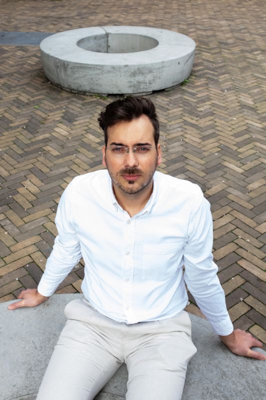
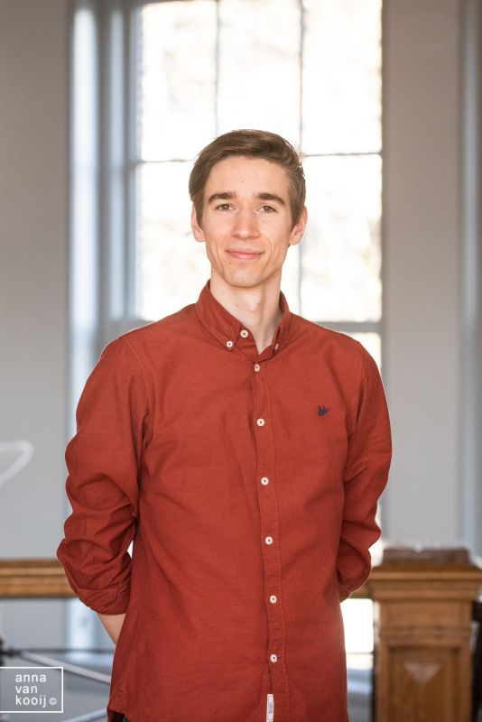
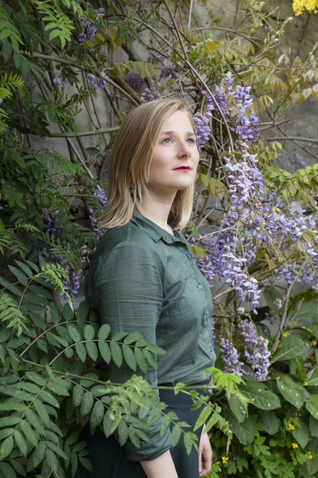
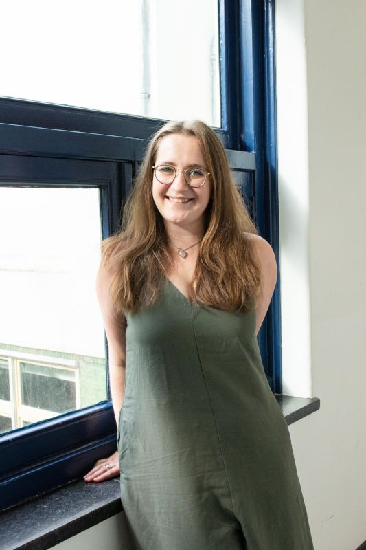
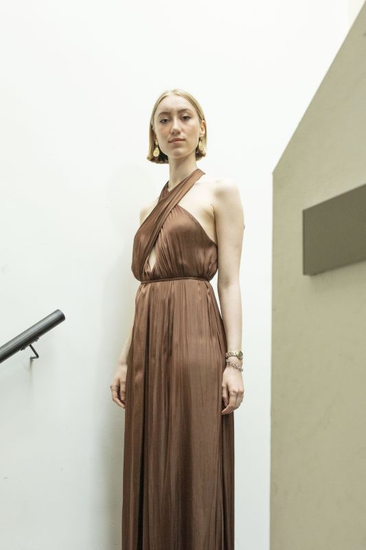
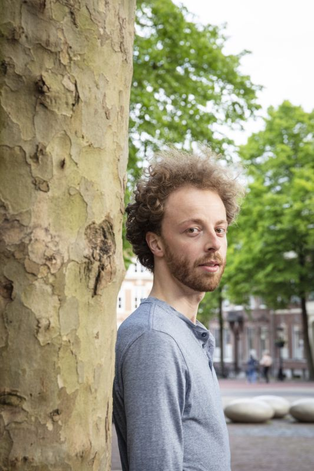
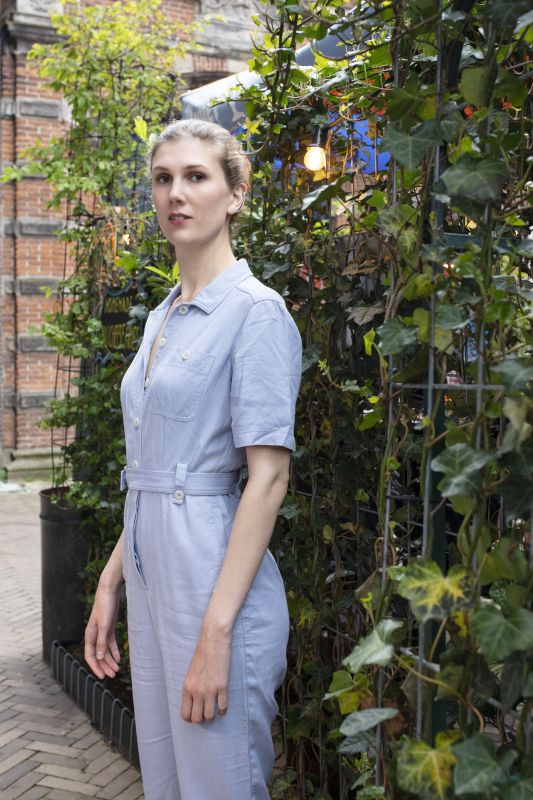

### Introduction

Welcome to the eye-friendly programme page for the performance of Bloom, by NKK NXT 20/21 (Immix). Please do not forget to turn your phone to silent and/or airplane mode when the concert starts.

### Programme

#### Ragnheiður Erla Björnsdóttir ⁠— _Bloom_

#### Ragnheiður Erla Björnsdóttir ⁠— _Okeme Babel_

#### Se Enkhbayar ⁠— _The Praise of Eight Steeds_

Lyrics (click)

**(Name of poet)**

Chinese text goes here
	<i>Translation goes here</i>
Chinese text goes here
    <i>Translation goes here</i>
Chinese text goes here
    <i>Translation goes here</i>
Chinese text goes here
    <i>Translation goes here</i>

#### Ragnheiður Erla Björnsdóttir ⁠— _re:shape_
#### Einojuhani Rautavaara ⁠— _Malagueña_

Lyrics

**Federico García Lorca**

La muerte 
	<i>Death</i>
entra y sale 
	<i>enters and leaves</i>
de la taberna. 
	<i>the tavern.</i> 
Pasan caballos negros 
	<i>Black stallions</i>
y gente siniestra 
	<i>and sinister people</i>
por los hondos caminos 
	<i>pass down the deep roads</i>
de la guitarra. 
	<i>of the guitar.</i> 
Y hay un olor a sal
    <i>And there is a smell of salt</i>
y a sangre de hembra, 
	<i>and of female blood,</i>
en los nardos febriles
	<i>in the feverish tuberoses</i>
de la marina. 
	<i>of the seaside.</i> 
La muerte 
	<i>Death</i>
entra y sale, 
	<i>enters and leaves</i>
y sale y entra 
	<i>and leaves and enters</i>
la muerte 
    <i>the death</i>
de la taberna.
    <i>of the tavern.</i>

#### Ragnheiður Erla Björnsdóttir ⁠— _curls I_

#### Erik Bergman ⁠— _Vier Galgenlieder_

2. <i>Tapetenblume</i>

**Christian Morgenstern**

Tapetenblume bin ich fein,
    <i>Wallpaper flowers am I prettily,</i>
kehr wieder ohne Ende,
    <i>return without end,</i>
doch, statt im Mai'n und Mondenschein,
    <i>but, instead of in May and moonlight,</i>
auf jeder der vier Wände.
    <i>on all four of the walls.</i> 
Du siehst mich nimmerdar genung,
    <i>You never see me enough,</i>
so weit du blickst im Stübchen,
    <i>as far as you look in the sitting room,</i>
und folgst du mir per Rösselsprung –
    <i>and if you follow me by a knight's move (chess) –</i>
wirst du verrückt, mein Liebchen. 
    <i>you'll go mad, my love.</i>

#### Ragnheiður Erla Björnsdóttir ⁠— _curls II_

#### Erik Bergman ⁠— _Vier Galgenlieder_

1. <i>Das grosse Lalula</i>

**Christian Morgenstern**

Kroklokwafzi? Sem̄emem̄i!
Seiokrontro – prafriplo:
Bifzi, bafzi; hulalem̄i:
quasti basti bo…
Lalu lalu lalu lalu la! 
Hontraruru miromente
zasku zes rü rü?
Entepente, leiolente
klekwapufzi lü?
Lalu lalu lalu lala la! 
Simarat kos malzlpempu
silzuzankunkrei (;)!
Marjomar dos: Quempu Lempu
Siri Suri Sei [ ]!
Lalu lalu lalu lalu la!

#### Ragnheiður Erla Björnsdóttir ⁠— _curls III_

#### Ruben Grevelink, Jobbe Hoebink & Jesse van der Wel ⁠— _When we don't see_

Lyrics

**Jobbe Hoebink**

(Todo: Ask Jobbe for lyrics)

#### James MacMillan ⁠— _O Radiant Dawn_

Lyrics

O Radiant Dawn,
Splendour of eternal Light,
Sun of Justice: come,
Shine on those who dwell in darkness
And the shadow of death.
Isaiah had prophesied, 
'The people who walked in darkness
have seen a  great light:
Upon those who dwelt in the land of gloom
a light has shone.'
Amen.     

#### William Byrd — _Ave Verum Corpus_

Lyrics

Ave verum Corpus, natum
    <i>Hail true body, born</i>
De Maria Virgine,
    <i>of virgin Mary,</i>
Vere passum, immolatum
    <i>having truly suffered, sacrificed</i>
In cruce pro homine,
    <i>on the cross for mankind,</i>
Cuius latus perforatum
    <i>from whose injured side</i>
Unda fluxit sanguine:
    <i>whence flows blood:</i>
Esto nobis praegustatum
    <i>Be for us a foretaste</i>
In mortis examine.
    <i>in the trial of death.</i>
O dulcis, O pie, O Jesu Fili Mariae, miserere mei.
    <i>O sweet, o holy, o Jesus son of Mary, have mercy on me.</i>
Amen.

#### Jobbe Hoebink ⁠— _Hier. Nu._

Text

Hier Jobbe's tekst
    <i>met vertaling</i>

#### Folk improvisation

Vär timma är som en månad lång

Vär timma är som en månad lång,
    <i>Every hour is as long as a month,</i>
vär månad som ett år.
    <i>every month as a year.</i>
Så längtar jag efter dig,
    <i>So much do I long for you,</i>
min lilla vän,
    <i>my sweet friend,</i>
fast jag dig aldrig får.
    <i>although I will never have you.</i>

English song

What are the lyrics?

#### Ragnheiður Erla Björnsdóttir ⁠— _Heol Heol_

### Credits

#### Performers

Sebastiaan Ammerlaan (NL)

<figure class="fr-l w-20-l ml-auto-l  fr-m w-20-m ml-auto-m br3 ma1 ba b--light-gray">
    
</figure>

Ever since Sebastiaan (Bas) Ammerlaan begged his parents for violin lessons when he was four, music took a strong hold of him. He soon changed the violin for the viola, then started singing, studying classical singing at the HKU Utrecht Conservatoire with Jón Þorsteinsson and Selma Harkink. Today he studies at the Master for Ensemble Singing at the Royal Conservatoire with Harry van Berne and Gerda van Zelm.

Ruben Grevelink (NL)

<figure class="fr-l w-20-l ml-auto-l fr-m w-20-m ml-auto-m br3 ma1 ba b--light-gray">
    
</figure>

Bio here

Julie Hasfjord (NO)

<figure class="fr-l w-20-l ml-auto-l fr-m w-20-m ml-auto-m br3 ma1 ba b--light-gray">
    
</figure>

Bio here

Jobbe Hoebink (NL)

<figure class="fr-l w-20-l ml-auto-l fr-m w-20-m ml-auto-m br3 ma1 ba b--light-gray">
    
</figure>

Bio here

Phoebe Kirrage (UK)

<figure class="fr-l w-20-l ml-auto-l fr-m w-20-m ml-auto-m br3 ma1 ba b--light-gray">
    
</figure>

Bio here

Emma Nelson (UK)

<figure class="fr-l w-20-l ml-auto-l fr-m w-20-m ml-auto-m br3 ma1 ba b--light-gray">
    
</figure>

Bio here

Ariel Sin Yu Lee (HK)

<figure class="fr-l w-20-l ml-auto-l fr-m w-20-m ml-auto-m br3 ma1 ba b--light-gray">
    
</figure>

Bio here

Jesse van der Wel (NL)

<figure class="fr-l w-20-l ml-auto-l fr-m w-20-m ml-auto-m br3 ma1 ba b--light-gray">
    
</figure>

Bio here

Merel Wentink (NL)

<figure class="fr-l w-20-l ml-auto-l fr-m w-20-m ml-auto-m br3 ma1 ba b--light-gray">
    
</figure>

Bio here

#### Director

Stijn Dijkema

<figure class="fr-l w-20-l ml-auto-l fr-m w-20-m ml-auto-m br3 ma1 ba b--light-gray">
    
</figure>

Bio here

#### Camera

Charlie Feld

<figure class="fr-l w-20-l ml-auto-l fr-m w-20-m ml-auto-m br3 ma1 ba b--light-gray">
    
</figure>

Bio here

#### Sound

That guy's name here

<figure class="fr-l w-20-l ml-auto-l fr-m w-20-m ml-auto-m br3 ma1 ba b--light-gray">
    
</figure>

Bio here

#### Composer

Ragnheiður Erla Björnsdóttir

<figure class="fr-l w-20-l ml-auto-l fr-m w-20-m ml-auto-m br3 ma1 ba b--light-gray">
    
</figure>

Bio here

